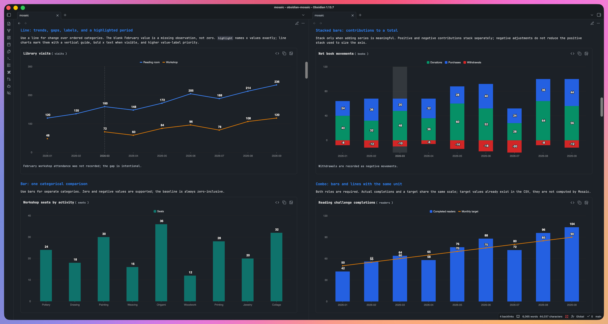
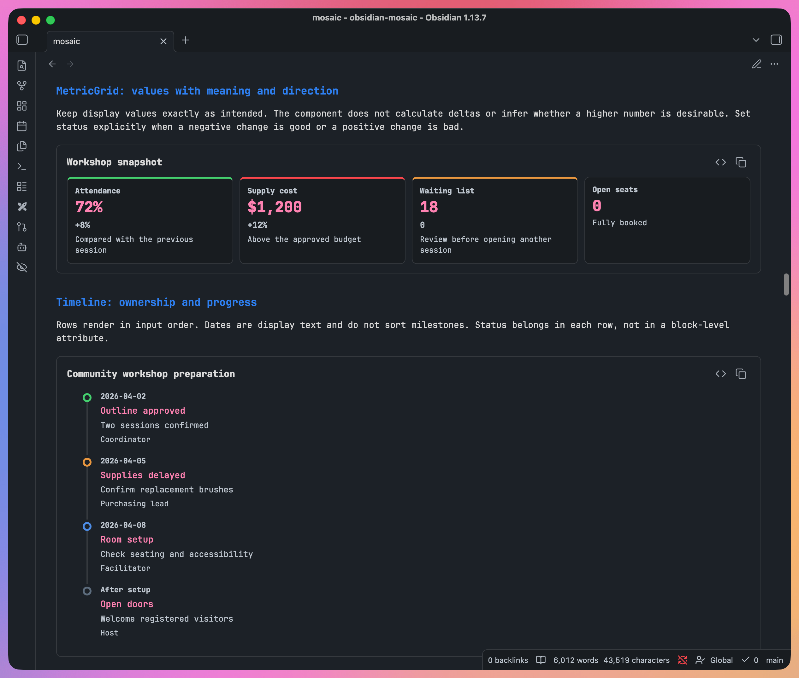
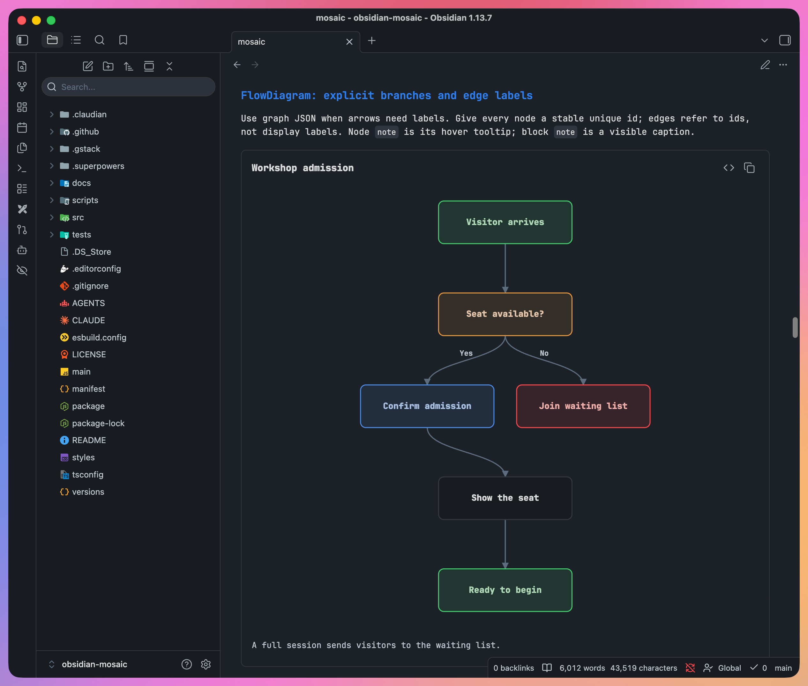
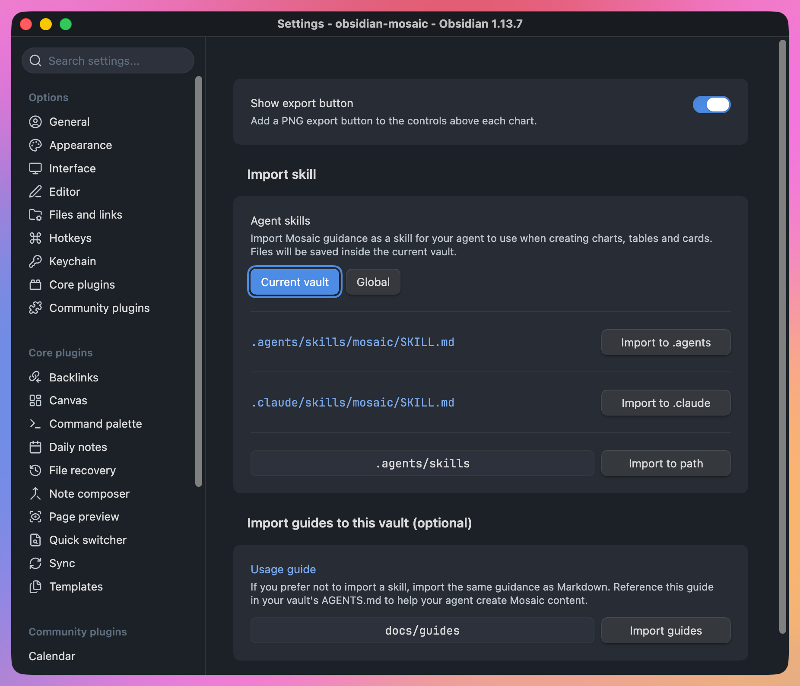

<!-- markdownlint-disable -->

<h1 align="center">Mosaic</h1>

<p align="center"><em>Obsidian 的声明式内容块</em></p>

<p align="center">
  <a href="https://github.com/GilbertzzzZZ/obsidian-mosaic/releases"></a>
  <a href="https://obsidian.md"></a>
  <a href="../LICENSE"></a>
</p>

<p align="center"><a href="../README.md">English</a> | <b>简体中文</b></p>

<br />

> 图表与卡片，方便人阅读。纯文本上下文，方便智能体理解。

Mosaic 把 Obsidian 笔记中的文字内容显示为图表、表格、卡片、时间线和流程图。**专为人与 AI 智能体共同撰写笔记而设计**：数据和描述保留为可读的文字，你看到的是直观的呈现。

文字是人与智能体共用的原始内容。智能体直接读取和修改数值、标签与上下文，不必从图片中反推信息。你在 Obsidian 中直观地阅读同一篇笔记，不需要另存一张图片再反复更新。

[下载](https://github.com/GilbertzzzZZ/obsidian-mosaic/releases/latest) · [让智能体使用](#让智能体使用) · [文档](#文档)

<p align="center">
  
</p>

## 可以用来展示什么

> 在需要解释信息的地方加入可视化内容，不必离开 Obsidian。

| 想表达什么 | 内容块 | 使用场景 |
| --- | --- | --- |
| 趋势与对比 | [Chart（图表）](guides/chart-zh.md) | 月度统计、实际值与目标对比 |
| 一条条具体记录 | [DataTable（数据表）](guides/data-table-zh.md) | 库存、结果、任务清单 |
| 关键数字及其状态 | [MetricGrid（指标卡片）](guides/metric-grid-zh.md) | 带变化值和说明的每周概览 |
| 里程碑与进展 | [Timeline（时间线）](guides/timeline-zh.md) | 发布计划、项目历程 |
| 决策及其依据 | [DecisionBox（决策卡片）](guides/decision-box-zh.md) | 决定了什么、谁负责、为什么 |
| 步骤与分支 | [FlowDiagram（流程图）](guides/flow-diagram-zh.md) | 审批流程、故障处理流程 |

<p align="center">
  
</p>

- 内容块可以与普通段落放在同一篇笔记里。
- 少量数据直接写在内容块中。Chart 和 DataTable 还可以通过[数据集清单](guides/dataset-guide-zh.md)读取仓库内共用的数据文件。
- 渲染不会改写笔记。原始内容仍然是可以搜索、编辑和进行版本管理的文字。

<p align="center">
  
</p>

---

## 安装

> 需要 Obsidian 1.13.0 及以上版本。
> 内容块在**阅读视图**中显示，不支持 Live Preview（实时预览）。

1. 从[最新发布版本](https://github.com/GilbertzzzZZ/obsidian-mosaic/releases/latest)下载 `main.js`、`manifest.json` 和 `styles.css`。
2. 在仓库的 `.obsidian/plugins/` 目录中创建 `mosaic` 文件夹，将这三个文件复制进去。
3. 重新加载 Obsidian，在「设置 → 第三方插件」中启用 **Mosaic**。
4. 打开包含 Mosaic 内容块的笔记，切换到**阅读视图**。

- 支持桌面端和移动端。全局技能导入仅限桌面端。
- 从普通的 `.md` 笔记开始即可。Mosaic 也支持 `.mdx` 文件，但不会执行 MDX 或 JavaScript。

---

## 让智能体使用

> 先把 Mosaic 的写作指导交给智能体，再让它根据你的数据生成笔记。

Mosaic 不内置 AI 助手，也不连接模型。请使用你自己的、能够访问仓库的智能体。你也可以手写所有内容块。

<p align="center">
  
</p>

1. 打开「设置 → Mosaic → **Import skill**（导入技能）」。
2. 保持选中 **Current vault**（当前仓库），选择智能体使用的目录。导入一份即可：
   - **Import to .agents** 写入当前仓库的 `.agents/skills/mosaic/SKILL.md`。
   - **Import to .claude** 写入当前仓库的 `.claude/skills/mosaic/SKILL.md`。
3. 让智能体先阅读 Mosaic 技能，再撰写笔记。能否自动发现技能，取决于你使用的智能体。
4. 提供数据，并说明希望笔记回答什么问题。在 Obsidian 的**阅读视图**中检查结果。

例如，附上一份月度出席数据表后，可以发送以下提示词：

```text
Read the Mosaic skill. Turn the attached attendance data into an Obsidian
note with a trend chart and a short written summary. Use only the supplied
values. Ask me about missing information rather than inventing it.
```

- **自定义目录：**点击路径框选择技能的上级文件夹，再点击 **Import to path**。文件会写入该目录下的 `mosaic/SKILL.md`。
- **全局范围：**桌面端可以明确选择 **Global**（全局），将技能导入当前仓库之外。每个按钮旁都会显示目标路径。
- **更想用普通 Markdown 指南？**在 **Import guides to this vault (optional)**（可选：导入指南到当前仓库）中保留 `docs/guides`，点击 **Import guides**。在仓库的 `AGENTS.md` 中引用 `docs/guides/Mosaic-Usage-Guide.md`，要求智能体在创建 Mosaic 内容前阅读它。Mosaic 不会替你修改 `AGENTS.md`。

技能和普通指南包含同一份完整英文参考，覆盖六类内容块的示例。详见[导入位置与更新行为](guides/agent-guide-zh.md)，也可以[直接阅读指导正文](../src/agent-guide/mosaic.md)。

---

## 试一个内容块

> 无需配置智能体。
> 将下面整个代码块复制进笔记，再切换到阅读视图。

````text
```chart
---
title: Workshop seats by session
type: bar
x: session
series: Seats
SeatsColor: "#0F766E"
unit: seats
labels: true
---
session,Seats
Morning,24
Afternoon,18
Evening,30
```
````

- 两个 `---` 之间的内容用于命名图表、选择显示方式。下方的各行是数据。
- 修改一个数值后回到阅读视图，图表会反映修改后的文字内容。
- 示例使用虚构数据。撰写自己的笔记时，请提供真实数值。
- 六类内容块都支持带类型名称的代码块和[标签写法](guides/tag-syntax-zh.md)。建议从代码块开始，避免标签受段落边界规则影响。

**如果仍然看到原始文字**

- 确认 Mosaic 已启用，笔记处于**阅读视图**，而不是编辑视图。
- 复制示例时，保留开头和结尾的反引号。
- 如果内容块显示错误，先阅读其中的提示。求助时可以用错误框的复制按钮附上错误报告。

---

## 小而专注

> 覆盖常见的信息表达方式，同时保持插件小巧。

- **文字优先。**普通段落、列表或 Markdown 表格已经能讲清楚时，就不必使用内容块。可视化应当让对比、状态或顺序更容易理解。
- **满足常用需求，主动控制边界。**聚焦实用图表和少量内容块，不追求覆盖所有图表类型或图表库选项。新增能力必须值得它带来的复杂度。
- **可靠的基本体验比功能数量更重要。**优先做好清晰的呈现、明确的错误提示和 Obsidian 中的一致行为，不把插件扩展成通用仪表盘搭建器。
- **负责显示，不负责执行。**Mosaic 不是智能体平台、电子表格计算引擎或脚本环境。它不运行 JavaScript、SQL 或公式。支持阅读视图，不支持实时预览。

---

## 文档

> 本页负责上手。
> 完整语法、示例和排错说明请查阅指南。

- **给智能体的写作指导：**[完整 Mosaic 参考](../src/agent-guide/mosaic.md)与[指导导入说明](guides/agent-guide-zh.md)。
- **内容块指南：**[Chart](guides/chart-zh.md)、[DataTable](guides/data-table-zh.md)、[MetricGrid](guides/metric-grid-zh.md)、[Timeline](guides/timeline-zh.md)、[DecisionBox](guides/decision-box-zh.md)、[FlowDiagram](guides/flow-diagram-zh.md)。
- **通用语法与数据：**[标签语法](guides/tag-syntax-zh.md)与[外部数据集](guides/dataset-guide-zh.md)。
- **面向开发者：**[架构设计](design/architecture.md)、[工程指南](engineering/)、[发版流程](engineering/publishing-to-obsidian.md)与[上游渲染同步](engineering/openglance-rendering-sync.md)。

用户指南提供中英文版本。工程指南和导入的智能体参考只提供英文版本。

---

## 隐私与文件访问

> Mosaic 在本地运行，没有网络请求、遥测、账号或广告。

- **笔记数据留在仓库内。**数据集文件通过 Obsidian 的仓库接口读取。Mosaic 不上传内容，也不会把内容发送给智能体。你另外使用的智能体有其自身的隐私行为。
- **指导导入写入你选择的位置。**默认导入当前仓库。桌面端需要先选择 **Global**，再点击导入按钮，才会向仓库外写入技能。移动端不支持全局导入。
- **自动更新范围有限。**每次插件加载时，Mosaic 检查已记录的导入位置，只更新由自己写入且未经修改的文件。全局选择和记录仅保存在该仓库的本机环境中。手动导入会替换目标文件的全部内容，包括你的修改。详见[更新说明](guides/agent-guide-zh.md#自动更新方式)。
- **不修改智能体配置。**导入指导不会启动智能体、修改客户端配置、创建符号链接或扫描其他文件。
- **剪贴板只写不读。**复制按钮会写入剪贴板，Mosaic 不读取剪贴板内容。
- **`.mdx` 扩展名注册作用于整个仓库。**Mosaic 让 Obsidian 把 `.mdx` 文件作为 Markdown 打开，包括没有 Mosaic 内容块的文件。若其他插件已处理该扩展名，Mosaic 会跳过注册。
- **声明不是可执行代码。**图表使用随插件打包的 [Ant Design Charts](https://github.com/ant-design/ant-design-charts) 库，该库采用 MIT 许可证。

---

## 参与贡献与许可证

> 欢迎错误报告和目标明确的改进。
> Mosaic 采用 MIT 许可证。

- 请在 [Issues（问题反馈）](https://github.com/GilbertzzzZZ/obsidian-mosaic/issues)中报告问题。附上使用非敏感示例数据的最小内容块、Obsidian 和 Mosaic 版本，以及文件是 `.md` 还是 `.mdx`。
- 提出功能需求时，请说明反复遇到的写作或阅读问题，以及现有内容块或普通 Markdown 为什么无法解决它。
- 本地开发需要 Node.js 22 及以上版本，依次执行 `npm ci`、`npm test`、`npm run build`。
- 许可证条款见 [LICENSE](../LICENSE)。
