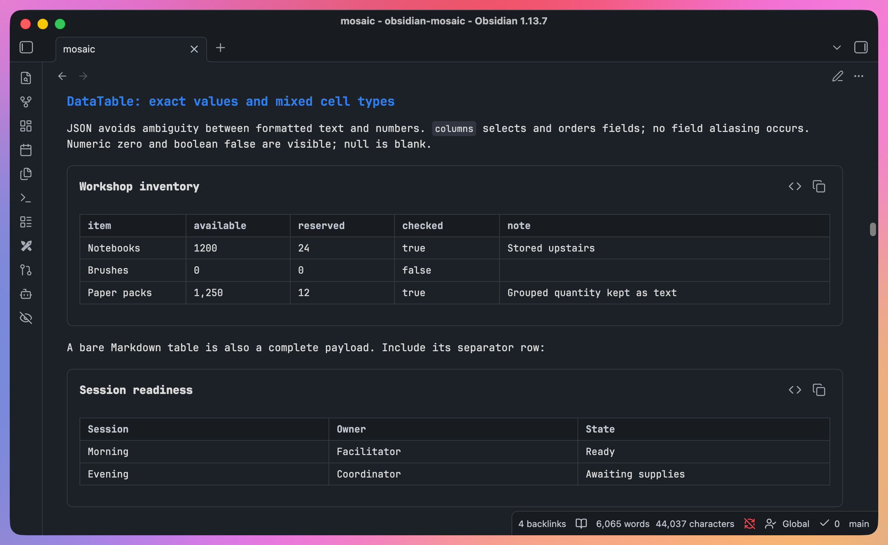

# DataTable

<p align="center"><b>English</b> | <a href="data-table-zh.md">简体中文</a></p>

> How to use the DataTable block: two data sources — an inline table (CSV / JSON / Markdown table) or an external dataset (`.dataset.json`) — feeding one shared rendering.
> Two physical forms: a tag (usually paired; the self-closing form only makes sense in `dataset` mode) and a ```` ```datatable ```` code block. Same attribute contract, identical rendering.
> Shared tag rules are in [tag-syntax.md](tag-syntax.md); the rationale behind the layout algorithm and the two data sources is in [design/data-table.md](../design/data-table.md).



## Read the examples

> Complete inline code-block examples are runnable Mosaic content, not screenshots.

- In Obsidian Reading view with Mosaic enabled, these examples render as their corresponding visual blocks.
- On GitHub, in Reading view without Mosaic, or in Source mode, the original syntax remains visible and copyable. Switch to Source mode in Obsidian to edit an example.
- Tag syntax, external-dataset examples that require extra files, and error examples stay as source for reference and copying rather than rendering automatically.

---

## Writing it

**Paired tag, inline data** (the main form). Attributes go on the opening tag, the payload goes in the body.

````text
<DataTable title="Line items" columns="item,amount,note">
```csv
item,amount,note
sample-a,10,ok
sample-b,5,watch
```
</DataTable>
````

- Writing boundaries — single-line opening tag, no blank lines in the body, quoting forms and the `=` rule, a closing tag alone on its line and case-sensitive — are in [tag-syntax.md](tag-syntax.md).

**Self-closing tag, dataset mode** (an empty body is allowed, so this form is only common when referencing an external dataset):

```text
<DataTable
  dataset="demo.dataset.json"
  columns="AnchorDate,Revenue"
  granularity="month"
  granularityOptions="month,quarter"
/>
```

- All five blocks parse self-closing tags, but the other four (MetricGrid / Timeline / DecisionBox / FlowDiagram) have nothing to render without a payload. Written self-closing, they either error on empty data or — DecisionBox only — render an empty shell. Neither is usually what you want.

**Code block, inline data.** Attributes go in a `---` block (flat `key: value`, one per line, values may be quoted, `#` starts a comment) and the payload follows the closing `---`.

```datatable
---
title: "Line items"
columns: "item,amount,note"
---
item,amount,note
sample-a,10,ok
sample-b,5,watch
```

**Code block, dataset mode.** Attributes only, no payload.

````text
```datatable
---
dataset: "demo.dataset.json"
columns: "AnchorDate,Revenue"
granularity: month
granularityOptions: "month,quarter"
---
```
````

- **Write the payload bare — do not wrap it in another fence.** A paired tag needs its payload inside a ` ```csv ` fence; a code block does not, because the payload is already inside one. Write an inner fence of the same length and the host reads it as the closing fence of the outer block, truncating everything from that line on.
- The opening and closing `---` are hard boundaries — miss one and the whole block errors. The attribute lines themselves are forgiving: malformed lines are skipped, the table renders anyway, and the notice bar names which lines were skipped. Only when not a single attribute can be read does the whole block fall back.
- Attribute names and meanings do not depend on where you write them: the table below holds for both forms.

## Attributes

| Attribute | What it does | Default |
| --- | --- | --- |
| `title` | Table title, rendered in the block header (same position as the other four blocks, so it does not disappear when you switch to source) | no title rendered |
| `columns` | Comma-separated column list; overrides the inferred column order | the union of all row keys, in order of first appearance |
| `dataset` | Relative path to an external `.dataset.json` manifest; its presence switches on dataset mode | none |
| `granularity` | Display granularity in dataset mode | `auto` |
| `granularityOptions` | Allowed granularities in dataset mode, comma-separated; each must be one of `day` / `week` / `month` / `quarter` | `day,week,month,quarter` |
| `from` / `to` | Inclusive date range in dataset mode | none |

> **A DataTable renders one way, whatever its size.** There used to be a complexity heuristic: past a row or column threshold the table would sprout a filter box, a freeze-first-column checkbox, a Copy CSV button and a sticky header, with five attributes — `complexity` / `search` / `freeze` / `copyCsv` / `sticky` — to override it. The whole thing is gone. The trigger was the physical size of the data, which has nothing to do with whether a given table needs those features, and the result was that the same `<DataTable>` showed readers two different components.
>
> The one automatic behaviour that stays is **layout width** (`fit` / `wrap` / `scroll`), which is the same content arranged for different container widths — not a difference in features.

**The `columnLabels` trap.** DataTable does have a notion of column display names, but it is **generated automatically from a dataset query** (taking each field's `label` from the manifest) and **cannot** be written as a tag attribute. Tag attribute parsing always produces strings, so `columnLabels="..."` — whatever you write — is judged "not an object" and silently ignored, leaving the raw column names in the header. To customise header text, declare it in the manifest's `fields[].label` (see [dataset-guide.md](dataset-guide.md)) rather than adding this attribute to the tag.

## Payload contract

**Inline mode** (no `dataset` attribute). The body goes through the [four row-extraction paths](tag-syntax.md#the-four-row-extraction-paths). Two rules are specific to DataTable:

- **No field-alias normalisation.** Column names are the raw keys, unless `columns` reorders or trims them.
- **Number sniffing.** Only cells matching `^-?\d+(?:\.\d+)?$` exactly (a plain integer or decimal) become numbers. Everything else — empty strings, dates, `"12%"`, `"1,234"` — stays a string and is displayed verbatim.

Boolean cells from JSON or typed datasets display as `true` or `false`. Null and missing cells remain empty. Numeric zero displays as `0`.

**Dataset mode** (with a `dataset` attribute). **Completely exclusive with an inline payload.** Rows come entirely from the external manifest plus its data file, **the body must be empty**, and the time range is written as `from` / `to` attributes:

````text
<DataTable dataset="demo.dataset.json" columns="AnchorDate,Revenue" from="2025-01-01" to="2025-06-01" />
````

The code-block form is identical, body still empty:

````text
```datatable
---
dataset: "demo.dataset.json"
columns: "AnchorDate,Revenue"
from: "2025-01-01"
to: "2025-06-01"
---
```
````

> **The body used to accept a ` ```query ` fence** — a JSON object with `from` / `to` / `where`. It was removed. `where` (filtering by field) was the only thing it could express that attributes cannot, and a full scan of real notes turned up not one use of it. The fence also could not be written inside a code block — an inner fence of the same length closes the outer one — so it made DataTable's two forms non-equivalent for nothing. If field filtering is ever genuinely needed, one more attribute will do; there is no need for a second body syntax.

The granularity switcher, the provenance footnote (dataset title · effective window · granularity · N/M source rows · data through), time-alignment validation, `rollup` semantics and the dataset manifest contract itself are all identical to Chart — see [dataset-guide.md](dataset-guide.md). One difference: Chart drops overly dense granularity options at its 120-point readability ceiling, whereas DataTable has **no such limit** and keeps every safely coarsened granularity in the candidate set.

### Error examples

Red error box, root cause surfaced in place, always prefixed with `Mosaic: `:

```text
Empty inline payload, or an empty column set
→ Mosaic: DataTable requires CSV, JSON, or a Markdown table.

A non-empty body in dataset mode (they are exclusive; the content does not matter)
→ Mosaic: Provide either dataset= or an inline body, not both.

An empty dataset attribute value
→ Mosaic: dataset must point to a .dataset.json manifest.

granularity outside the set expanded from granularityOptions
→ Mosaic: granularity must be included in granularityOptions.

granularityOptions containing anything but day/week/month/quarter
→ Mosaic: granularityOptions supports day, week, month, and quarter.
```

Deeper query errors in dataset mode — time alignment, granularity coarsening, `rollup` gaps — share their query semantics with Chart; the full list is in the troubleshooting section of [dataset-guide.md](dataset-guide.md).

The cases where the source renders as-is — not taken over, not an error box — are identical for every tag block; see [tag-syntax.md](tag-syntax.md#when-the-source-renders-as-is).

## Related

- [tag-syntax.md](tag-syntax.md) — shared tag rules and the common row-extraction rules
- [dataset-guide.md](dataset-guide.md) — the manifest contract, query semantics and troubleshooting shared by dataset mode
- [chart.md](chart.md) — the Chart block, dataset mode's sibling implementation
- [design/data-table.md](../design/data-table.md) — why this layout algorithm and these two data sources
- [mosaic-intro.md](../mosaic-intro.md) — overall positioning and roadmap
