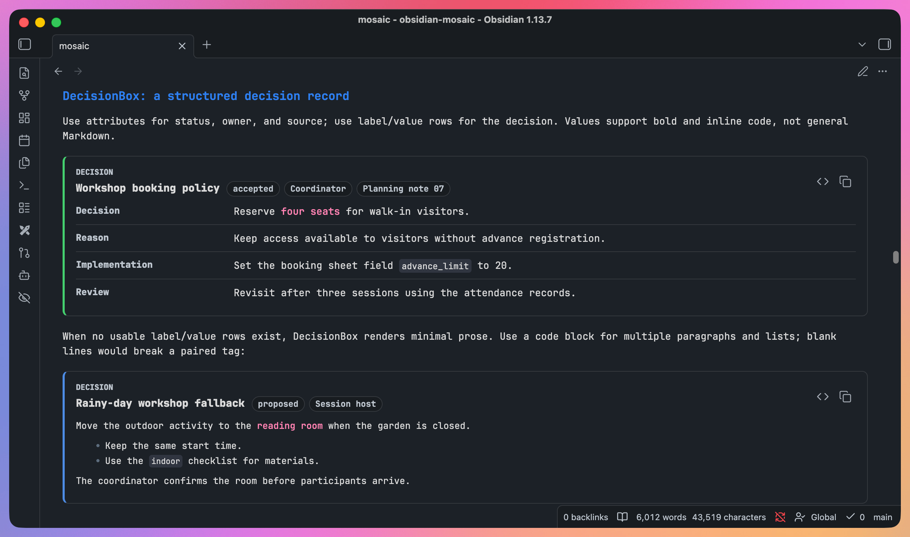

# DecisionBox

<p align="center"><a href="decision-box.md">English</a> | <b>简体中文</b></p>

> DecisionBox 内容块的使用指导（how）：结构化的 label/value 决策清单，或空 payload 时回退成一段极简富文本。
> 两种物理写法：成对标签与 ```` ```decisionbox ```` 代码块，同一套属性契约。只支持内联 payload——不支持 `dataset` 属性。
> DecisionBox 是五类组件里**唯一在空/非结构化 payload 时不报错**的一个（误用 `dataset` 或畸形 JSON 仍会报错，见「报错示例」）。
> **富文本回退要写多段，只能用代码块写法**——理由见下文。
> 标签写法通则见 [tag-syntax.md](tag-syntax-zh.md)；双路径与永不报错立场的设计动机见 [design/decision-box.md](../design/decision-box.md)。



## 查看示例

> 完整的内联代码块示例就是可运行的 Mosaic 内容，不依赖截图。

- 在启用 Mosaic 的 Obsidian 阅读视图中，这些示例直接显示为对应的图表或卡片。
- 在 GitHub、未启用插件的阅读视图或源码模式中，可以查看并复制原始写法。在 Obsidian 中切换到源码模式即可编辑示例。
- 标签语法、需要额外文件的外部数据集示例和错误示例保留为源码，供学习和复制，不自动渲染。

---

## 写法

**结构化 label/value 数据**：属性写在开标签上，payload 是 label/value 行：

````text
<DecisionBox title="示例决策" status="accepted" owner="alice" source="RFC-001">
```csv
label,value
决策,采用方案 A
代价,迁移成本约两周
```
</DecisionBox>
````

**自由文本回退**（不写结构化数据，或数据里没有可用的 label/value）：

```text
<DecisionBox title="示例决策">
我们选择方案 A，理由是实现简单、迁移成本可控。
</DecisionBox>
```

- 写法边界（开标签必须单行、标签体内不能有空行等）见 [tag-syntax.md](tag-syntax-zh.md)。
- **「标签体内不能有空行」对 DecisionBox 的富文本回退影响尤其大**：富文本路径按空行分段，但标签体一旦出现空行整个标签就不会被接管，因此**自由文本回退实际只能承载单段文字或一个无序列表**，写多段落（段落之间留空行）会直接导致整个标签按原文渲染，而不是渲染出多个 `<p>`。需要多段说明时请改用结构化 label/value 数据（每行不含空行）。
- 无序列表写法（`- ` 或 `* ` 开头）在同一段落内是安全的，因为列表项之间不需要空行：

```text
<DecisionBox title="示例决策">
- 优点：实现简单
- 缺点：扩展性一般
</DecisionBox>
```

**代码块写法**：属性写进 `---` 属性区（扁平 `key: value`，一行一个，值可用引号包裹，`#` 开头是注释），payload 紧跟在闭合的 `---` 之后。

```decisionbox
---
title: "Storage engine"
status: accepted
owner: alice
source: RFC-001
---
label,value
Decision,Use SQLite for the local cache
Cost,Roughly two weeks of migration
```

**代码块解除了富文本回退的单段限制。** 上面那条「标签体内不能有空行」是宿主的段落切分规则，管的是标签，代码块不受它管——代码块的边界是围栏，里面的空行只是普通空行。所以多段说明写成代码块就能正常渲染成多个 `<p>`：

```decisionbox
---
title: "Storage engine"
---
We are going with SQLite: simple to implement, and the migration cost is contained.

Second paragraph: the migration ships in two waves — internal environments first, then production.
```

- **payload 裸写，不要再套一层围栏。** 成对标签的结构化 payload 要写在 ` ```csv ` 围栏里，代码块的不用——payload 已经在代码块里了。真写了同长度的内层围栏，宿主会把它当成外层围栏的闭合，代码块在那一行就被截断。
- `---` 的开头与闭合是硬边界，缺一个整块报错；属性行本身则宽容——写歪的行被跳过，决策框照常渲染，底部提示条点名跳过了哪几条。只有一条属性都读不出来时才整块退回。
- 属性表与 payload 契约对两种写法同时成立，包括 `status` / `owner` / `source` 的归一化。

## 属性表

| 属性 | 说明 | 归一化 |
| --- | --- | --- |
| `title` | 渲染为组件标题，无则不渲染 | 无 |
| `status`（别名 `decisionStatus`，取值优先级 `status` > `decisionStatus`） | 决策状态徽章，同时决定外层容器的 CSS 变体 | 见下表 |
| `owner` | 责任人徽章 | 直接透传 |
| `source` | 来源徽章 | 直接透传 |

DecisionBox **不支持 `dataset`**。若在标签上写 `dataset="..."`，会被当作外部数据集组件处理但因不在支持名单内而报错（见下）。

**status 状态词表**（状态词自动归一化，支持的词表见下）：

| 归一化结果 | 命中输入 |
| --- | --- |
| `accepted` / `proposed` / `rejected` / `superseded` | 显式写这四个值之一，原样透传 |
| `accepted` | `done` / `complete` / `completed` |
| `default` | 其他任意非空值 |
| `""`（不渲染徽章） | 未设置或空字符串 |

**归一化结果决定左边框的颜色**（跟随主题的扩展色板）：

| 状态 | 左边框 |
| --- | --- |
| `accepted` | 绿 |
| `rejected` | 红 |
| `proposed` | 主题强调色（与 Timeline 的 `active` 同义：提议中，还没定） |
| `superseded` | 灰（已被后来的决定取代——不是失败，只是过期） |
| `default` / 未设置 | 不染色，保持中性 |

**徽章上的文字是属性原样取值，不是归一化结果**：写 `status="done"` 徽章显示 `done`，而左边框按 `accepted` 染成绿色。归一化只影响颜色。

固定文案：区块头部左上角有一个不可配置的 kicker 标签，内容固定为 `Decision`（CSS 控制为大写显示），不是数据字段，永远显示。

## Payload 契约

标签体走[通用行提取四路径](tag-syntax-zh.md#通用行提取四路径)，解析出 rows 后按 label/value 别名归一化：

| 输出字段 | 别名优先级 |
| --- | --- |
| `label` | `label` ?? `key` ?? `name` ?? `item` |
| `value` | `value` ?? `text` ?? `body` ?? `description` ?? `summary` |

`label` 与 `value` 都为空的行被过滤。

**两条互斥路径**：

- **路径 A（结构化）**：过滤后至少 1 条 label/value 行时启用，渲染为 `<dl>` 定义列表；`value` 支持行内 `` `code` `` 和 `**bold**` 两种极简 markdown，其余原样转义（不支持斜体、链接、删除线、标题、引用块）。
- **路径 B（富文本回退）**：过滤后 0 条 label/value 行时启用，把整段标签体当作极简 Markdown 渲染——按空行分段（受上文 Obsidian 限制，实际只有单段生效）、`- `/`* ` 开头的行归入无序列表，其余非空行拼成一个段落。

**永不报错**：即使标签体完全为空（或自闭合无 body），也只是渲染出一个空的富文本区块，不会走错误框。这是 DecisionBox 与 DataTable/Timeline/MetricGrid/FlowDiagram 的关键差异——那四类在 rows 为空时都会报错，DecisionBox 不会。

### 报错示例

DecisionBox 本身没有「空数据」错误路径。会触发红色错误框的情形只有两类：

```text
标签上出现 dataset 属性（DecisionBox 不支持外部数据集）
→ Mosaic: External datasets support Chart and DataTable.

fenced json 围栏内是不合法 JSON
→ Mosaic: Unexpected token ... in JSON at position ...（原生 JSON 解析错误，文案随具体错误位置变化）
```

后者不是 DecisionBox 专属，是[通用行提取](tag-syntax-zh.md#通用行提取四路径)对畸形 JSON 的统一行为。

按原文渲染（不接管、不是错误框）的情形对全部标签组件一致，见 [tag-syntax.md](tag-syntax-zh.md#按原文渲染的通用情形)；其中「标签体内出现空行」连带导致「多段落富文本回退」实际不可用，见上文写法说明。

## 相关文档

- [tag-syntax.md](tag-syntax-zh.md)——标签写法通则与通用行提取规则
- [timeline.md](timeline-zh.md) · [metric-grid.md](metric-grid-zh.md)——同样以词表归一状态的姊妹组件
- [design/decision-box.md](../design/decision-box.md)——双路径、状态归一与极简 markdown 子集的设计动机
- [mosaic-intro.md](../mosaic-intro.md)——整体定位与 Roadmap
